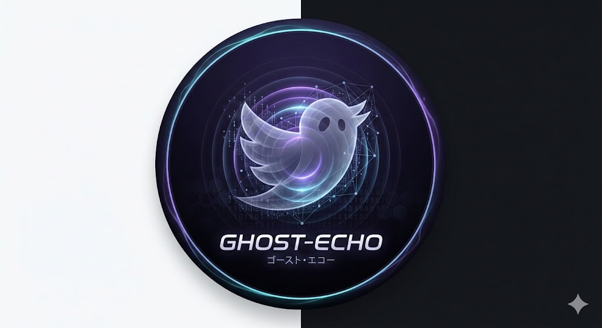

# 👁‍🗨 Project Ghost-Echo (ゴースト・エコー)

<div align="center">
  
</div>

> **「深淵を覗く時、深淵もまたこちらを覗いている。ならば、その影を盗み出すまでだ。」**

**Ghost-Echo** は、崩壊しゆく秩序（SNS）の深層に潜り込み、無数の言霊（リプライ）を静かに収穫するための禁断のブラウザ拡張機能（Ether-Linker）である。 独自の**「擬似生命律動アルゴリズム（Human Mimicry Logic）」**を搭載し、監視の目を欺きながら、タイムラインに刻まれた幽かな残響を確実に記録する。


## 主な機能
- **通信傍受 (Stealth Fetch Hooking)**: APIレスポンスを直接キャプチャし、正確なデータを取得。
- **視認ベースの取得**: `IntersectionObserver` を使用し、画面に表示された要素のみを処理。
- **自動重複排除**: 同一セッション内での重複データを自動的にフィルタリング。
- **データ管理 (Dashboard)**: 専用の管理画面で収集データの検索・フィルタリング・一覧表示が可能。
  - **日時ソート機能**: 新しい順／古い順での並び替えサポート。
- **エクスポート**: データを JSON または CSV 形式でダウンロード。
- **データ保存**: `IndexedDB` を使用した堅牢なローカル保存。全データクリア機能も完備。
- **デバッグモード**: ポップアップから生データのコンソール出力を切り替え可能。

## セキュリティとプライバシー
- **完全ローカル動作**: 収集したデータが外部サーバーに送信されることはありません。すべての処理はブラウザ内で完結します。

## ドキュメント
- [操作マニュアル (usage.md)](./doc/usage.md)
- [開発計画 (development-plan.md)](./doc/development-plan.md)
- [開発手順書 (Development Guide.md)](./doc/Development%20Guide.md)

## 開発の始め方

### 推奨技術スタック
- **Vite** + **React**
- **TypeScript**
- **Vanilla CSS** (for extension UI)
- **Manifest V3**

### セットアップ
詳細な開発手順については [Development Guide](file:///home/agenda23/workspace/Ghost-Echo/doc/Development%20Guide.md) を参照してください。

## プロジェクト構成
```text
.
├── doc/                # ドキュメント
│   └── Development Guide.md
├── src/                # ソースコード
│   ├── background/     # サービスワーカー、オフスクリーン処理
│   ├── content/        # Xのページに注入されるスクリプト
│   ├── popup/          # 拡張機能のUI
│   ├── dashboard/      # データ閲覧・管理画面 (React)
│   └── lib/            # 共通ライブラリ（DB管理、ユーティリティ）
└── manifest.json       # 拡張機能の設定ファイル
```

## ライセンス
MIT License